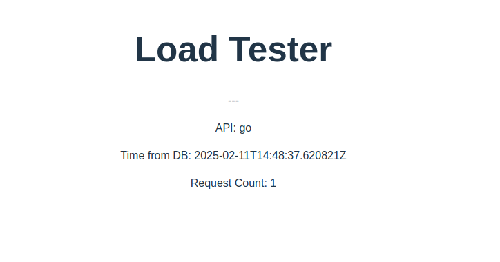

# Load Generator

This is a minimal web application with the following microservices

- **React frontend:** Uses react query to load data from an api and display the result.
- **Go API:** Both have `/` and `/ping` endpoints. `/` queries the Database for the current time and the number of requests for each api recorded within the database, and `/ping` returns `pong`.
- **Postgres Database:** An empty PostgreSQL database with no tables or data. Used to show how to set up connectivity. The API applications execute `SELECT NOW() as now;` to determine the current time to return.

We have also included a load tester to simulate client requests
- **Python Load Generator:** Queries the GO API at a configurable speed.




## Running the Application

__set up__

Before we get started, you will need to download and install devbox - which manages all system dependencies.

- [install devbox](https://www.jetify.com/devbox/docs/installing_devbox/) 

---

__overview__

To keep things consistent, we have commands in the Taskfile.yaml for each folder to tell you exactly how to run it.

There are two ways to run. 
1. **Docker** is for local development AND you need to build and push the images. View [src/Taskfile.yaml](src/Taskfile.yaml).
2. **Kubernetes** is for deployment, uses KinD (kubernetes in Docker) for local or AWS for cloud.  View [helm/Taskfile.yaml](helm/Taskfile.yaml).

__initiate shell__

- it is important to note that this repo uses my Dockerhub, `superelectron`, for everything. You'll need to replace any references.

```bash
# start the shell session
$ devbox shell
Starting a devbox shell...

```

__build docker images__

Now, let's build those docker containers.

```bash
# go into the src directory to build the docker images
cd src

# list the tasks (gives comprehensive list, we only care about the commands below)
task --list-all

# build and push
task build

# clean up the work, and release all references
task clean
task clean_deep

# go back to root directory
cd ..
```


__run with kubernetes__

And, we can deploy locally using KinD, to run the kubernetes cluster

```bash
# go into Kubernetes directory
cd helm

# start the KinD cluster 
task prepare

# Open another terminal, and run this to start
task start

# after you are done, clean up (will wipe all helm references too)
# you can kill the other terminal after this
task stop
task delete
```

---
